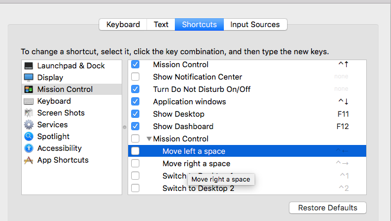
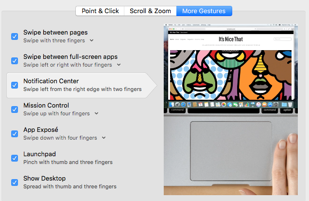
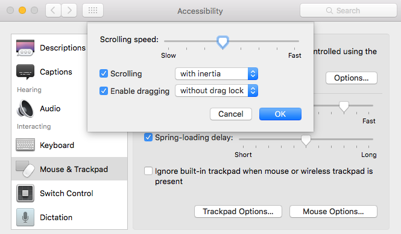

### Before Ansible

**System Preferences**

* Turn off Mission Control shortcuts

* Turn on "Tap to click"

* Set up "More Gestures"

* Set up Accessibility > Mouse & Trackpad > Trackpad Options

**Install apps**

* MacVim
* Authy
* Dropbox
* 1Password
* Chrome
* Firefox
* iTerm2
* hyperdock
* BetterTouchTool
* XCode
* Alfred
* Homebrew
* brew install git ansible

### Set up iTerm2

After running the ansible tasks:

* Change shell
* Sync preferences

### Set up Alfred

* Sync preferences
